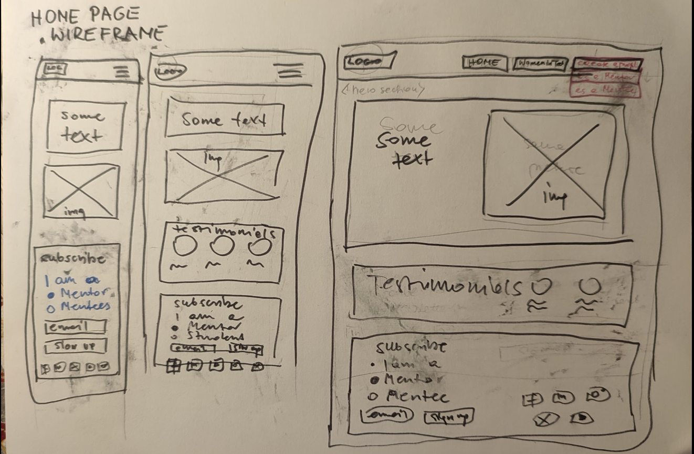
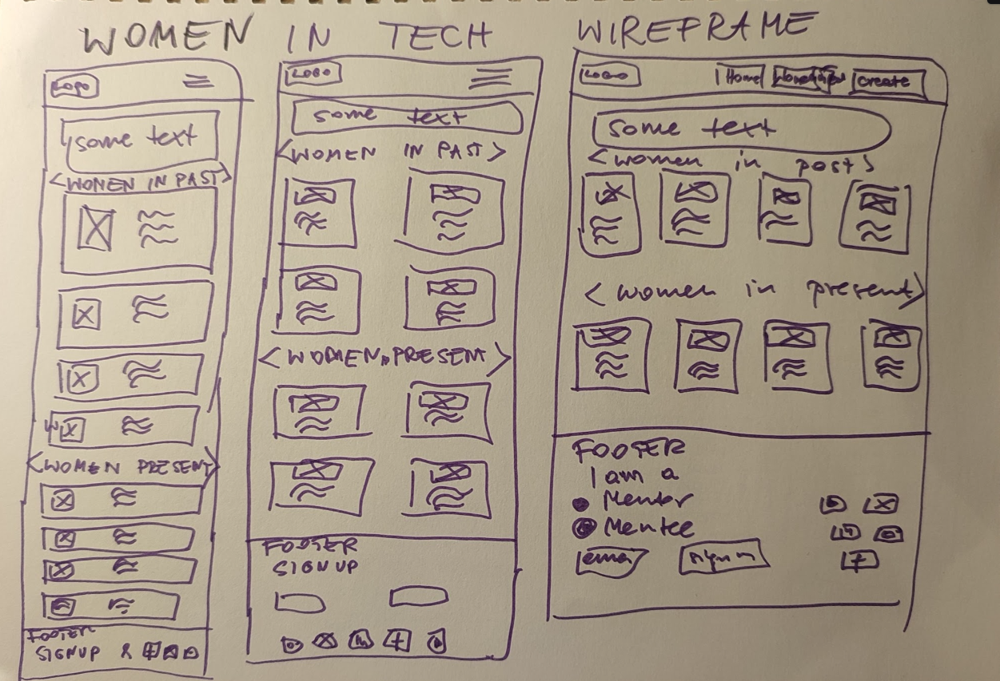

# HackHerSpace

## User Experience

### Project Goals
HackHerSpace is a project by 5Stars Team with the primary goal of uplifting, supporting, and inspiring women in coding and STEM fields. 5Stars Team aims to create a welcoming and inclusive community where women of all ages, backgrounds, and experiences can pursue their dreams in the tech industry.

As a member of HackHerSpace, you can take on the role of a mentor, sharing your knowledge and guiding other women in coding and technology. Or, as a mentee, you can learn from experienced women in the field, gaining valuable skills and support in a safe and encouraging environment.

### User Stories
**1. As a 15-year-old girl with an interest in ICT, I am looking for a place where I can connect with other girls and peers who share my passion. I want to have conversations about technology and feel part of a supportive community.**

Acceptance Criteria:

* Users can sign up and create a profile.
* The UI is responsive and accessible.
* Users can post, reply, and engage in discussions.

Tasks:

* Set up Django for user authentication (registration & login).
* Use Tailwind to design a friendly and accessible UI.
* Create a discussion forum where mentees can ask general questions

**2. As a woman interested in computing, I would like to learn more about the contributions of women in both the past and present. I want to discover inspiring female role models who can serve as my ‘heroines’ and motivate me in my own journey.**

Acceptance Criteria:

* Users can browse profiles of influential women in tech.
* The design is engaging with images, quotes, and contributions.

Tasks:

* Create a “Women in Tech” section with profiles of historical and modern figures.
* Use Tailwind to design a hero section featuring inspiring women.

**3. I would like to meet other women in a safe and inclusive environment where I can develop my skills and confidence without being affected by stereotypes associated with the male-dominated tech industry.**

Acceptance Criteria:

* A reporting system is in place for inappropriate content.
* Users can join and participate in safe groups.

Tasks:

* Allow users to report inappropriate content to ensure safety.
* Set up moderation tools in Django Admin to manage reports.

**4. I am a woman who has started learning to code, but I sometimes feel discouraged because I don’t see many women around me in tech. I want to find a supportive community, mentorship, and success stories of women in technology so that I can stay motivated and confident in my journey.**

Acceptance Criteria:

* Users can find and request mentors.
* A newsletter system is in place for motivation.
* Users can read success stories and submit their own.

Tasks:

* Implement a mentorship matching system.
* Add a Success Stories page featuring women who overcame challenges in tech.
* Allow users to submit their own success stories through a Django form.
* Create a weekly newsletter/email system to share inspirational content.
* Use Tailwind to design a motivating and visually appealing layout.

**5. As a woman who has been in the software development industry for over 20 years, I would like to encourage and support young girls and other women so they can become part of the tech industry.**

Acceptance Criteria:

* Experienced women can sign up as mentors and be matched with mentees.

Tasks:

* Implement a mentorship programme where experienced women can sign up as mentors.
* Use Tailwind to design a professional but welcoming interface for mentors.

**6. As an experienced coder, I want to mentor in the programming language I feel most confident in, so I can provide guidance and support to mentees in my area of expertise.**

Acceptance Criteria:

* Mentors can select one or more programming languages they specialise in.
* Mentees can filter mentors based on their preferred language.
* A mentee can request mentorship, and the mentor receives a notification.

Tasks:

* Allow mentors to select their preferred programming languages when signing up.
* Create a Django model for mentor profiles, including expertise fields.
* Implement a matching system where mentees can request mentorship based on language expertise.

### Design:

#### Colours/Fonts
Our team didn’t initially agree on a specific design for our website. A Windows 95-inspired look was suggested, with a grey navbar and footer, similar to the status bar in Windows 95, featuring a shadow box effect. However, things took their own course, and we ended up with a charming mix—something reminiscent of the wild west of 90s web design, when there were no strict rules. Early 2000s newspaper and university websites were also suggested as inspiration, and the homepage was designed based on one of these sites.

Fonts weren’t agreed upon either, so I’m just as curious about the final result as anyone else! The same goes for wireframes—although some sketches with design suggestions did appear by day two. 😊

#### Wireframes

## Agile Methodology

#### Kanban Board

## Features

#### Navbar

#### Footer

#### Home

#### About

#### Mentors

#### Questions

#### History

#### Contact

## Technologies Used

## Code

## Testing

### Bugs

### Unresolved Bugs

### Testing User Stories

### Manual Testing

### Accessibility

## Deployment

## Maintaince & Updates

## Credits

### Media

### Content

### Design

