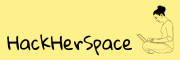
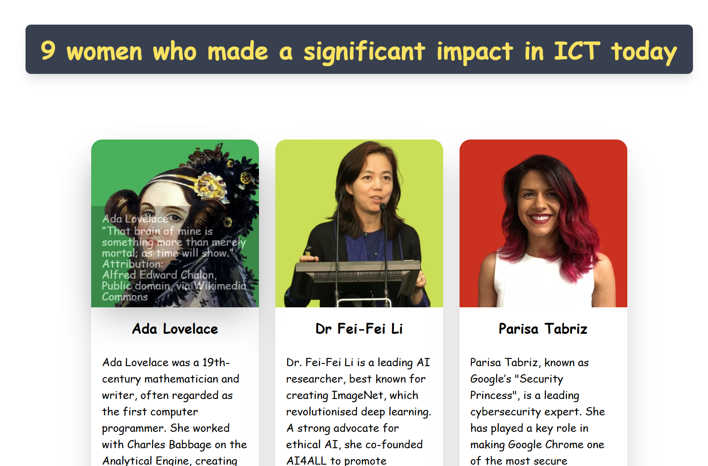

# HackHerSpace

 

# Table of Contents
- [User Experience](#user-experience)
    - [Project Goals](#project-goals)
    - [User Stories](#user-stories)
    - [Design](#design)
- [Agile Methodology](#agile-methodology)
- [Features](#features)
- [Technologies Used](#technologies-used)
- [Code](#code)
- [Testing](#testing)
    - [Bugs](#bugs)
    - [Testing User Stories](#testing-user-stories)
    - [Manual Testing](#manual-testing)
- [Deployment](#deployment)
- [Credits](#credits)

##  User Experience

### Project Goals
HackHerSpace is a project by 5Stars Team with the primary goal of uplifting, supporting, and inspiring women in coding and STEM fields. 5Stars Team aims to create a welcoming and inclusive community where women of all ages, backgrounds, and experiences can pursue their dreams in the tech industry.

As a member of HackHerSpace, you can take on the role of a mentor, sharing your knowledge and guiding other women in coding and technology. Or, as a mentee, you can learn from experienced women in the field, gaining valuable skills and support in a safe and encouraging environment.

### User Stories
**1. As a 15-year-old girl with an interest in ICT, I am looking for a place where I can connect with other girls and peers who share my passion. I want to have conversations about technology and feel part of a supportive community.**

Acceptance Criteria:

* Users can sign up and create a profile.
* The UI is responsive and accessible.
* Users can post, reply, and engage in discussions.

Tasks:

* Set up Django for user authentication (registration & login).
* Use Tailwind to design a friendly and accessible UI.
* Create a discussion forum where mentees can ask general questions

**2. As a woman interested in computing, I would like to learn more about the contributions of women in both the past and present. I want to discover inspiring female role models who can serve as my ‘heroines’ and motivate me in my own journey.**

Acceptance Criteria:

* Users can browse profiles of influential women in tech.
* The design is engaging with images, quotes, and contributions.

Tasks:

* Create a “Women in Tech” section with profiles of historical and modern figures.
* Use Tailwind to design a hero section featuring inspiring women.

**3. I would like to meet other women in a safe and inclusive environment where I can develop my skills and confidence without being affected by stereotypes associated with the male-dominated tech industry.**

Acceptance Criteria:

* A reporting system is in place for inappropriate content.
* Users can join and participate in safe groups.

Tasks:

* Allow users to report inappropriate content to ensure safety.
* Set up moderation tools in Django Admin to manage reports.

**4. I am a woman who has started learning to code, but I sometimes feel discouraged because I don’t see many women around me in tech. I want to find a supportive community, mentorship, and success stories of women in technology so that I can stay motivated and confident in my journey.**

Acceptance Criteria:

* Users can find and request mentors.
* A newsletter system is in place for motivation.
* Users can read success stories and submit their own.

Tasks:

* Implement a mentorship matching system.
* Add a Success Stories page featuring women who overcame challenges in tech.
* Allow users to submit their own success stories through a Django form.
* Create a weekly newsletter/email system to share inspirational content.
* Use Tailwind to design a motivating and visually appealing layout.

**5. As a woman who has been in the software development industry for over 20 years, I would like to encourage and support young girls and other women so they can become part of the tech industry.**

Acceptance Criteria:

* Experienced women can sign up as mentors and be matched with mentees.

Tasks:

* Implement a mentorship programme where experienced women can sign up as mentors.
* Use Tailwind to design a professional but welcoming interface for mentors.

**6. As an experienced coder, I want to mentor in the programming language I feel most confident in, so I can provide guidance and support to mentees in my area of expertise.**

Acceptance Criteria:

* Mentors can select one or more programming languages they specialise in.
* Mentees can filter mentors based on their preferred language.
* A mentee can request mentorship, and the mentor receives a notification.

Tasks:

* Allow mentors to select their preferred programming languages when signing up.
* Create a Django model for mentor profiles, including expertise fields.
* Implement a matching system where mentees can request mentorship based on language expertise.

### Design:

#### Colours
Our team didn’t initially agree on a specific design for our website. A Windows 95-inspired look was suggested, with a grey navbar and footer, similar to the status bar in Windows 95, featuring a shadow box effect. However, things took their own course, and we ended up with a charming mix—something reminiscent of the wild west of 90s web design, when there were no strict rules. Early 2000s newspaper and university websites were also suggested as inspiration, and the homepage was designed based on one of these sites.

* Colour palette

#### Typography

The project uses the font-[cursive] utility from Tailwind CSS to apply a cursive font style to specific elements for a playful, retro aesthetic.

#### Wireframes

* Hompage Wireframe 

* Women in Tech Wireframe 

* Mentor Page Wireframe 

* Q&A Wireframe 

##  Agile Methodology

#### Kanban Board

The team utilized a Kanban board to effectively divide tasks and track progress. This approach ensured clear task ownership, streamlined collaboration, and maintained focus on project goals.

The project's Kanban Board can be viewed [here](https://github.com/users/Joha-will/projects/10)

##  Features

#### Navbar

Each page features the same navbar, designed in a 90s-inspired style—grey with black text. The buttons in the navbar are centred, and there are seven links leading to different pages.

#### Footer

Every page also shares a minimalist footer, which contains only a simple copyright notice for a clean and consistent look.

#### Home

The homepage, also designed in a 90s-inspired style, is divided into three sections.

At the centre is the most important part, featuring a leading text explaining what HackHer Space is and its core principles. Below this, there's a 90s-era image of a woman drinking coffee in front of a computer.

On both sides, there are sidebars with links that lead nowhere—purely for aesthetic nostalgia.

#### About

The About page consists of two sections: About Us and Our Mission, each displayed on a black background with white text and yellow headings.

#### Mentors

The Mentors page follows the same 90s-inspired style, featuring two sidebars.

In the central section, there are portraits of the available mentors, each accompanied by a short bio detailing their expertise and background.

#### Questions

The Q&A page is divided into two sections.

On the left side, there are five topics to choose from: Python, CSS, JavaScript, HTML, and Django. Clicking on a topic reveals a set of related questions.

On the right side, there is a form where users can select a topic (Python, JavaScript, etc.) and enter their question in a text area. Below, a "Submit Question" button allows users to send their queries.

#### Women in Tech

The Women in Tech page showcases nine pioneering women selected by our team, ranging from Ada Lovelace and Frances Allen to our youngest heroine, Katie Bouman.

The profiles are arranged in a 3x3 grid, with each card featuring a portrait on a solid, colourful background. The original backgrounds were removed and replaced with warm tones to contrast with the grey 90s aesthetic.

When hovered over, each card reveals a quote from the featured woman. Below, a short bio highlights her contributions to technology.

#### Contact

The Contact page features a short introduction to our 5Star Team, followed by five cards displayed on a dark background. Each card includes the team member's name, position, a short description, and an image.

##  Technologies Used

- HTML
- CSS
- Tailwind CSS
- Javascript
- Python
- Django

* [Birme](https://www.birme.net/?image_format=webp&quality_webp=60) to resize, crop, compress and change the image format to WEBP.

* [Pixabay](https://pixabay.com/vectors/girl-laptop-type-typing-woman-158465/) to downland the images for the logo and favicon.

* [Favicon](https://favicon.io/) to create favicon.

* [GitHub](https://github.com/) to store the project, project board and collaboration.

* [Remove bg](https://www.remove.bg/) to remove the background and add a solid colour background for portrait photos.

* [Canva](https://www.canva.com/) was used to create logo, wireframes.

* [Coolors](https://coolors.co/) to make a colour palette

##  Code

##  Testing

### Bugs

### Unresolved Bugs

### Testing User Stories

**2. As a woman interested in computing, I would like to learn more about the contributions of women in both the past and present. I want to discover inspiring female role models who can serve as my ‘heroines’ and motivate me in my own journey.**

Women in Tech page with profiles of historical and modern figures. The design is engaging with images, quotes, and contributions

### Manual Testing

### Accessibility

To ensure accessibility, we have provided descriptive `alt` attributes for all images used throughout the project. This allows screen readers to convey meaningful information about the images to visually impaired users.

Additionally, we utilised Tailwind CSS to create a responsive design, ensuring that the website is accessible and user-friendly across various devices and screen sizes. Tailwind's utility-first approach allowed us to implement consistent and adaptive layouts efficiently.

##  Deployment

This project was deployed on Heroku.

Deploying the Project on Heroku:

### Steps for Deployment on Heroku

The website was deployed to Heroku and can be found [here](https://hackherspace-5aa8dc5907fb.herokuapp.com/).

- Heroku is a cloud platform that lets developers create, deploy, monitor and manage apps.
- You will need a Heroku log-in to be able to deploy a website to Heroku.
- Once you have logged into Heroku:
- Click 'New' > 'Create new app'
- Choose a unique name, choose your region and press 'Create app'
- Click on 'Settings' and then 'Reveal Config Vars'
- Add a key of 'DISABLE_COLLECTSTATIC' with a value of '1'.
- Add a key of 'DATABASE_URL' - the value will be the URL you were emailed when creating your database.
- Add a key of 'SECRET_KEY' - the value will be any random secret key (google 'secret key generator' and use it to generate a random string of numbers, letters and characters)
- In your terminal, type the code you will need to install project requirements:
pip3 install gunicorn~=20.1
pip3 install -r requirements.txt
pip3 freeze --local > requirements.txt
- Create an 'env.py' file at the root directory which contains the following:
import os
os.environ["DATABASE_URL"]='CI database URL'
os.environ["SECRET_KEY"]=" Your secret key"
- Create a file at the root directory called Procfile. In this file enter: "web: gunicorn my_project.wsgi" (without the quotes)
- In settings.py, set DEBUG to False.
- YOU SHOULD ALWAYS SET DEBUG TO FALSE BEFORE DEPLOYING FOR SECURITY
- Add ",'.herokuapp.com' " (without the double quotes) to the ALLOWED_HOSTS list in settings.py
- Add, commit and push your code.
- Go back to Heroku, click on the 'Deploy' tab.
- Connect your project to GitHub.
- Scroll to the bottom and click 'Deploy Branch' and your project will be deployed!

##  Credits

### Images

* Images for the Women in Tech / History page.
All Images were sourced from [Wikimedia Commons](https://commons.wikimedia.org/). With the exception of three, all required attribution under their respective copyright licenses.

    * [Dr Fei-Fei Li](https://commons.wikimedia.org/wiki/File:Fei-Fei_Li_at_AI_for_Good_2017.jpg);
 Attribution: ITU Pictures, CC BY 2.0 <https://creativecommons.org/licenses/by/2.0>, via Wikimedia Commons

    * [Parisa Tabriz](https://commons.wikimedia.org/wiki/File:Parisa_Tabriz_Blackhat%2717_profile.jpg); Attribution:
mrisher, CC BY-SA 4.0 <https://creativecommons.org/licenses/by-sa/4.0>, via Wikimedia Commons

    * [Katie Bouman](https://commons.wikimedia.org/wiki/File:Katie_Bouman_answers_questions_about_the_Event_Horizon_Telescope_project.jpg); Attribution:
Credit: NSF, Public domain, via Wikimedia Commons

    * [Timnit Gebru](https://commons.wikimedia.org/wiki/File:Timnit_Gebru_crop.jpg); Attribution:
https://commons.wikimedia.org/wiki/File:Timnit_Gebru_crop.jpg

    * [Radia Perlman](https://commons.wikimedia.org/wiki/File:Radia_Perlman_2009.jpg); Attribution:
Scientist-100 at English Wikipedia, Public domain, via Wikimedia Commons

    * [Frances Allen](https://commons.wikimedia.org/wiki/File:Allen_mg_2545-b.jpg); Attribution:
Rama, CC BY-SA 2.0 FR <https://creativecommons.org/licenses/by-sa/2.0/fr/deed.en>, via Wikimedia Commons

    * [Barbara Liskov](https://commons.wikimedia.org/wiki/File:Turing_Centenary_Celebration_Liskov.jpg); Attribution:
Dennis Hamilton from Seattle, Washington, USA, CC BY 2.0 <https://creativecommons.org/licenses/by/2.0>, via Wikimedia Commons

    * [Rana el Kaliouby](https://commons.wikimedia.org/wiki/File:Rana_El_Kaliouby.jpg); Cairue, CC BY-SA 4.0 <https://creativecommons.org/licenses/by-sa/4.0>, via Wikimedia Commons

    * [Ada Lovelace](https://commons.wikimedia.org/wiki/File:Ada_Lovelace_Chalon_portrait.jpg); Attribution:
Alfred Edward Chalon, Public domain, via Wikimedia Commons

* The illustration for the logo and the favicon was found on [Pixabay](https://pixabay.com/vectors/girl-laptop-type-typing-woman-158465/)

### Content

* [ChatGPT](https://openai.com/chatgpt/overview/) was used to review for spelling, grammar and consistency, and enhanced the content. Additionally, ChatGPT helped by providing information on the Women in Tech page.

* CoPilot within VSCode for code creation and debugging

### Team Members

The HackHerSpace team, known as the 5Stars Team, is a diverse group of passionate individuals dedicated to empowering women in technology. Each member brings unique skills and perspectives to the project, united by a shared vision of creating an inclusive and supportive community.

This project wouldn't have been possible without the invaluable contributions of the team members.

- **Anthony Nelson** - Django Developer
- **Joha Wilson** - Django Developer
- **Mubashir Hussain** - Frony-end Developer
- **Sonali Patni** - Front-end Developer
- **Dagmara Szproch** - Content Creator, Developer

Together, the 5Stars Team is committed to bridging the gender gap in tech and inspiring the next generation of women in STEM.

## Acknowledgment

We would like to extend our heartfelt gratitude to **Code Institute** for organizing this incredible hackathon and providing us with the opportunity to collaborate, innovate, and bring our creative ideas to life. The hackathon not only allowed us to challenge ourselves but also fostered a spirit of teamwork and learning that will stay with us beyond this project.

The platform and guidance offered by Code Institute have been instrumental in helping us explore new technologies, refine our skills, and create something meaningful. Their commitment to empowering developers and fostering a supportive community is truly inspiring.

Thank you, Code Institute, for encouraging creativity, collaboration, and growth through this amazing initiative!

